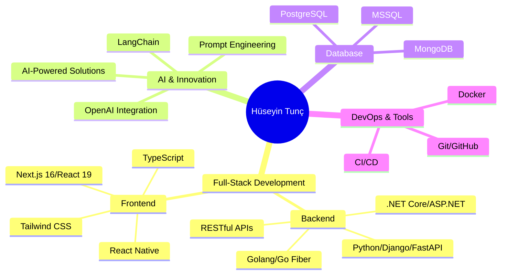

<div align="center">
  
# 🌟 Merhaba, Ben Hüseyin Tunç!

[](https://git.io/typing-svg)


</div>

---

## 💫 Hakkımda

```typescript
const huseyin = {
    location: "Gümüşhane, Türkiye 🇹🇷",
    role: "Full-Stack Developer",
    passion: ["☕ Kahve", "💻 Clean Code", "🚀 Innovation"],
    currentFocus: "DGS + Software Excellence",
    philosophy: "Fikir üret, kodla, yayınla. Benim öğrenme stilim: doğrudan üretim!",
    lifeGoal: "Full-stack alanında uzmanlaşmak ve dünyayı değiştirecek çözümler üretmek"
};
```

<div align="center">

### 🎯 Şu An Ne Yapıyorum?

🔭 **DGS**'ye hazırlanırken yapay zeka destekli projeler geliştiriyorum  
🌱 Her gün yeni teknolojiler öğrenip **gerçek dünya problemlerine** çözümler üretiyorum  
💡 **AI-powered** uygulamalar ile kullanıcı deneyimini geliştiriyorum  
🎨 Modern ve kullanıcı dostu **arayüzler** tasarlıyorum  

</div>

---

## 🎯 Yetkinlik Seviyeleri

<div align="center">

**Backend Development**


**Frontend Development**


**AI/ML Integration**


**Mobile Development**


**DevOps & Cloud**


</div>

---

## 🛠️ Teknoloji Arsenalim

<div align="center">

### 💻 Backend & Core


### 🎨 Frontend & UI/UX


### 🗄️ Veritabanı & Storage


### 📱 Mobil Geliştirme


### 🤖 AI & Machine Learning


### 🔧 Araçlar & DevOps


### 🏗️ Mimari & Yaklaşımlar


</div>

---

## 🚀 Öne Çıkan Projelerim

<div align="center">
  
</div>

<table>
<tr>
<td width="50%">

### 🔥 Vekaletim
**Yapay Zeka Destekli Hukuki Belge Hazırlayıcı**

- 🤖 AI tabanlı vekalet belgesi oluşturma
- ⚖️ Emsal karar analizi ve öneriler
- 📄 Otomatik belge formatlaması
- 🎯 Kullanıcı dostu arayüz

**Tech Stack:**  
`.NET` `Python` `OpenAI` `MongoDB`

</td>
<td width="50%">

### 🚀 DatalinguaLab
**AI Destekli Eğitim & Analiz Platformu**

- 📊 Akıllı test ve anket üretimi
- 🧠 AI tabanlı performans analizi
- 📈 Detaylı raporlama sistemi
- 🎓 Kurumsal çözümler

**Tech Stack:**  
`Next.js` `Python` `MongoDB` `AI/ML`

</td>
</tr>
<tr>
<td width="50%">

### 💡 Gech AI
**AI Görsel Üretim Platformu**

- 🎨 Metinden görsele AI dönüşümü
- ⭐ Favori galerisi sistemi
- 🖼️ Yüksek kaliteli görsel çıktıları
- 💾 Kullanıcı koleksiyonları

**Tech Stack:**  
`Next.js` `MongoDB` `Stability AI` `Tailwind`

</td>
<td width="50%">

### 🌟 Ve Daha Fazlası...
**Sürekli Gelişen Portfolio**

- 🔨 Yeni fikirler üzerinde çalışıyorum
- 🚀 Open-source katkılar
- 📚 Deneysel projeler
- 💻 Side projects

**Yakında:**  
`E-commerce` `SaaS` `API Services`

</td>
</tr>
</table>

---

## 📊 GitHub İstatistiklerim & Aktiviteler

<div align="center">
  


</div>

---

## 🏆 GitHub Trophies

<div align="center">
  
[](https://github.com/ryo-ma/github-profile-trophy)

</div>

---

## 💼 Profesyonel Beceriler

<div align="center">



</div>

---

## 📫 Benimle İletişime Geçin

<div align="center">

[](mailto:huseyint428@gmail.com)
[](https://linkedin.com/in/tunchuseyin29)
[](https://github.com/htunc29)

</div>

---

<div align="center">

### 💭 Favori Sözüm

> *"Kod yazmak bir sanattır, problem çözmek ise bu sanatın en güzel eseridir."*

### ☕ Bana Bir Kahve Ismarla

Projelerimi beğendiysen ve desteklemek istersen:

[](https://www.buymeacoffee.com/huseyintunc)


<a href="https://www.buymeacoffee.com/huseyintunc" target="_blank"></a>

</div>

---

<div align="center">
  


### 🌟 "Her satır kod, bir adım daha ileri!"


---

**⭐ Projelerimi beğendiysen yıldızlamayı unutma!**

*Son Güncelleme: 2025*

</div>

